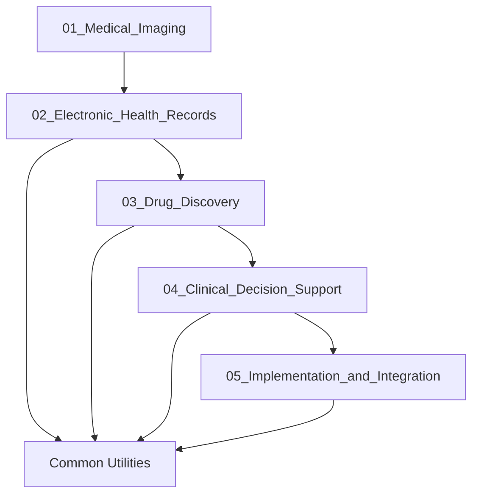

# Healthcare AI Examples: Modular Documentation

## Overview
This modular documentation provides comprehensive implementation examples of AI applications in healthcare, organized into focused modules for better performance and maintainability.

## Module Structure

### Core Modules
1. **[01_Medical_Imaging_and_Diagnostics.md](01_Medical_Imaging_and_Diagnostics.md)** - AI systems for medical imaging analysis including X-ray, CT, MRI, and other diagnostic modalities

2. **[02_Electronic_Health_Records.md](02_Electronic_Health_Records.md)** - AI-powered EHR management systems, clinical NLP, and predictive analytics

3. **[03_Drug_Discovery_and_Development.md](03_Drug_Discovery_and_Development.md)** - AI applications in pharmaceutical research and drug development

4. **[04_Clinical_Decision_Support.md](04_Clinical_Decision_Support.md)** - AI systems for clinical decision support and treatment recommendations

5. **[05_Implementation_and_Integration.md](05_Implementation_and_Integration.md)** - Deployment strategies, system integration, and operational considerations

### Navigation
- Each module is self-contained with comprehensive examples
- Cross-references are maintained between related modules
- Shared utilities and common components are documented in each relevant module
- Implementation examples are modular and can be used independently

## Quick Start

For a complete overview, start with [01_Medical_Imaging_and_Diagnostics.md](01_Medical_Imaging_and_Diagnostics.md) and proceed through each module based on your specific healthcare AI application needs.

## Module Dependencies

## Related Documentation

- [Industry Examples Index](../00_Industry_Examples_Index.md)
- [AI Implementation Guidelines](../../01_Fundamentals/01_AI_Implementation_Guidelines.md)
- [Data Privacy and Security](../../01_Fundamentals/04_Data_Privacy_and_Security.md)

---

*This modular documentation was created on 2025-09-29 to improve performance and maintainability of the original 3,009-line comprehensive Healthcare AI Examples file.*