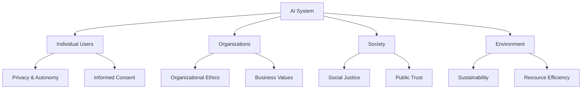

# AI Ethics Frameworks and Theoretical Foundations

## Overview

This section provides comprehensive theoretical foundations for AI ethics, covering fundamental ethical frameworks, principles, and theoretical approaches to responsible AI development and deployment.

## Ethical Foundations of AI

### Core Ethical Principles

#### 1. **Beneficence and Non-maleficence**
- **Do Good**: AI should promote human well-being and societal benefits
- **Do No Harm**: Prevent and mitigate potential harms from AI systems
- **Risk Assessment**: Systematic evaluation of potential negative impacts
- **Precautionary Principle**: Err on the side of caution when risks are uncertain

```python
# Ethical Risk Assessment Framework
class EthicalRiskAssessment:
    def __init__(self):
        self.harm_categories = [
            "physical_harm",
            "psychological_harm",
            "social_harm",
            "economic_harm",
            "rights_harm",
            "autonomy_harm"
        ]

    def assess_harm_potential(self, ai_system):
        """Assess potential harms across multiple dimensions"""
        harm_scores = {}
        for harm_type in self.harm_categories:
            harm_scores[harm_type] = self._evaluate_harm_type(ai_system, harm_type)
        return harm_scores

    def _evaluate_harm_type(self, system, harm_type):
        """Evaluate specific harm type likelihood and severity"""
        likelihood = self._calculate_likelihood(system, harm_type)
        severity = self._calculate_severity(system, harm_type)
        return likelihood * severity  # Risk score
```

#### 2. **Autonomy and Human Agency**
- **Human Control**: Maintain meaningful human control over AI systems
- **Informed Consent**: Ensure users understand AI capabilities and limitations
- **Privacy Preservation**: Protect individual autonomy through privacy safeguards
- **Decision Transparency**: Make AI decision processes understandable to humans

#### 3. **Justice and Fairness**
- **Distributive Justice**: Ensure fair distribution of AI benefits and burdens
- **Procedural Justice**: Fair processes in AI development and deployment
- **Restorative Justice**: Mechanisms to address AI-caused harms
- **Intersectional Fairness**: Consider multiple sources of disadvantage

#### 4. **Explicability and Transparency**
- **Model Interpretability**: Make AI models understandable to stakeholders
- **Decision Rationale**: Provide clear explanations for AI decisions
- **System Documentation**: Comprehensive documentation of AI capabilities
- **Audit Trails**: Maintain records of AI system decisions and actions

#### 5. **Accountability and Responsibility**
- **Clear Lines of Responsibility**: Define who is responsible for AI outcomes
- **Liability Frameworks**: Legal and ethical liability structures
- **Redress Mechanisms**: Processes for challenging AI decisions
- **Monitoring and Oversight**: Continuous monitoring of AI system impacts

### Ethical Frameworks

#### 1. **Utilitarian Framework**
- **Greatest Good Principle**: Maximize overall societal benefit
- **Cost-Benefit Analysis**: Systematic evaluation of impacts
- **Net Utility Calculation**: Quantitative assessment of positive vs. negative impacts

```python
# Utilitarian Ethics Implementation
class UtilitarianEthicsFramework:
    def __init__(self):
        self.stakeholder_groups = {
            "users": {"weight": 0.3},
            "developers": {"weight": 0.2},
            "society": {"weight": 0.3},
            "environment": {"weight": 0.2}
        }

    def calculate_utility(self, ai_system, stakeholders):
        """Calculate overall utility across all stakeholders"""
        total_utility = 0
        for group, weight in self.stakeholder_groups.items():
            group_utility = self._calculate_group_utility(ai_system, stakeholders[group])
            total_utility += group_utility * weight
        return total_utility

    def _calculate_group_utility(self, system, stakeholders):
        """Calculate utility for specific stakeholder group"""
        benefits = system.calculate_benefits(stakeholders)
        costs = system.calculate_costs(stakeholders)
        return benefits - costs
```

#### 2. **Deontological Framework**
- **Duty-Based Ethics**: Focus on moral duties and rules
- **Universal Principles**: Apply consistent ethical standards
- **Rights-Based Approach**: Respect for fundamental human rights
- **Rule-Based Decision Making**: Follow established ethical rules

#### 3. **Virtue Ethics Framework**
- **Character-Based Ethics**: Focus on moral character and virtues
- **Developer Virtues**: Cultivate ethical traits in AI developers
- **Organizational Culture**: Promote ethical organizational values
- **Professional Standards**: Maintain high ethical standards in AI practice

#### 4. **Care Ethics Framework**
- **Relational Approach**: Focus on relationships and care
- **Contextual Ethics**: Consider specific contexts and relationships
- **Empathy and Compassion**: Incorporate emotional intelligence
- **Community Focus**: Emphasize community well-being

## Theoretical Models for AI Ethics

### 1. **Multi-Level Stakeholder Model**



### 2. **Ethical Lifecycle Model**

```python
# Ethical AI Lifecycle Management
class EthicalLifecycle:
    def __init__(self):
        self.phases = [
            "conceptualization",
            "data_collection",
            "model_development",
            "testing_validation",
            "deployment",
            "monitoring",
            "decommissioning"
        ]

    def ethical_review_gate(self, phase, ai_system):
        """Conduct ethical review at each lifecycle phase"""
        ethical_checkpoints = {
            "conceptualization": self._review_purpose_and_scope,
            "data_collection": self._review_data_ethics,
            "model_development": self._review_model_ethics,
            "testing_validation": self._review_testing_ethics,
            "deployment": self._review_deployment_ethics,
            "monitoring": self._review_monitoring_ethics,
            "decommissioning": self._review_decommissioning_ethics
        }

        if phase in ethical_checkpoints:
            return ethical_checkpoints[phase](ai_system)
        return False

    def _review_purpose_and_scope(self, system):
        """Review ethical aspects of system purpose"""
        checks = [
            system.purpose.is_beneficial(),
            system.purpose.is_clearly_defined(),
            system.purpose.respects_human_dignity(),
            system.purpose.promotes_wellbeing()
        ]
        return all(checks)
```

### 3. **Ethical Risk Matrix Model**

```python
# Ethical Risk Assessment Matrix
class EthicalRiskMatrix:
    def __init__(self):
        self.likelihood_levels = ["very_low", "low", "medium", "high", "very_high"]
        self.impact_levels = ["minimal", "minor", "moderate", "major", "severe"]
        self.risk_levels = self._create_risk_matrix()

    def _create_risk_matrix(self):
        """Create risk assessment matrix"""
        matrix = {}
        for likelihood in self.likelihood_levels:
            for impact in self.impact_levels:
                risk_score = self._calculate_risk_score(likelihood, impact)
                matrix[(likelihood, impact)] = risk_score
        return matrix

    def assess_ethical_risk(self, scenario):
        """Assess ethical risk of a scenario"""
        likelihood = self._assess_likelihood(scenario)
        impact = self._assess_impact(scenario)
        return self.risk_levels[(likelihood, impact)]
```

## Bias and Fairness Theory

### Types of AI Bias

#### 1. **Data Bias**
- **Selection Bias**: Non-representative training data
- **Label Bias**: Biased or inconsistent labeling
- **Historical Bias**: Reflection of historical inequalities
- **Measurement Bias**: Flawed measurement tools or methods

#### 2. **Algorithmic Bias**
- **Model Architecture Bias**: Inherent biases in model design
- **Optimization Bias**: Biases introduced through optimization objectives
- **Feature Selection Bias**: Biased choice of input features
- **Parameter Tuning Bias**: Biases in hyperparameter selection

#### 3. **Deployment Bias**
- **Contextual Bias**: Bias in how AI is used in specific contexts
- **Interaction Bias**: Bias arising from human-AI interactions
- **Feedback Loop Bias**: Bias amplification through feedback systems

### Fairness Metrics and Theories

```python
# Fairness Metrics Implementation
class FairnessMetrics:
    def __init__(self):
        self.protected_attributes = ["race", "gender", "age", "socioeconomic_status"]

    def statistical_parity(self, predictions, protected_attribute):
        """Measure statistical parity across groups"""
        groups = np.unique(protected_attribute)
        group_rates = {}

        for group in groups:
            mask = protected_attribute == group
            group_rates[group] = np.mean(predictions[mask])

        # Calculate disparity
        max_rate = max(group_rates.values())
        min_rate = min(group_rates.values())
        disparity = max_rate - min_rate

        return {
            "group_rates": group_rates,
            "disparity": disparity,
            "parity_achieved": disparity < 0.1  # 10% threshold
        }

    def equal_opportunity(self, predictions, true_labels, protected_attribute):
        """Measure equal opportunity (true positive rate parity)"""
        groups = np.unique(protected_attribute)
        group_tpr = {}

        for group in groups:
            mask = protected_attribute == group
            group_positives = true_labels[mask] == 1
            group_predictions = predictions[mask] == 1
            group_tpr[group] = np.mean(group_predictions[group_positives])

        return self._calculate_fairness_score(group_tpr)

    def predictive_parity(self, predictions, true_labels, protected_attribute):
        """Measure predictive parity (precision parity)"""
        groups = np.unique(protected_attribute)
        group_precision = {}

        for group in groups:
            mask = protected_attribute == group
            group_pred_pos = predictions[mask] == 1
            if np.sum(group_pred_pos) > 0:
                group_precision[group] = np.mean(true_labels[mask][group_pred_pos])
            else:
                group_precision[group] = 0

        return self._calculate_fairness_score(group_precision)
```

## Privacy and Security Theory

### Privacy Theories and Models

#### 1. **Control-Based Privacy**
- **Individual Control**: Users control their personal data
- **Informed Consent**: Transparent data usage agreements
- **Data Minimization**: Collect only necessary data
- **Purpose Limitation**: Use data only for stated purposes

#### 2. **Harm-Based Privacy**
- **Privacy Harm Prevention**: Prevent specific privacy harms
- **Contextual Integrity**: Respect social contexts of data flow
- **Anonymity and Pseudonymity**: Protect individual identities
- **Data Protection**: Implement technical and organizational measures

#### 3. **Structural Privacy**
- **Power Asymmetries**: Address imbalances in data power
- **Collective Privacy**: Consider group privacy impacts
- **Societal Implications**: Evaluate broader social effects
- **Systemic Solutions**: Implement structural privacy protections

### Security Theoretical Foundations

```python
# AI Security Theoretical Framework
class AISecurityFramework:
    def __init__(self):
        self.threat_models = [
            "adversarial_attacks",
            "data_poisoning",
            "model_inversion",
            "membership_inference",
            "backdoor_attacks",
            "model_stealing"
        ]

    def threat_analysis(self, ai_system):
        """Analyze security threats to AI system"""
        threat_assessment = {}

        for threat in self.threat_models:
            threat_assessment[threat] = {
                "likelihood": self._assess_threat_likelihood(ai_system, threat),
                "impact": self._assess_threat_impact(ai_system, threat),
                "mitigation_strategies": self._get_mitigation_strategies(threat)
            }

        return threat_assessment

    def security_by_design(self, ai_system):
        """Implement security by design principles"""
        principles = [
            "least_privilege",
            "defense_in_depth",
            "fail_secure",
            "complete_mediation",
            "open_design",
            "separation_of_duties"
        ]

        implementation = {}
        for principle in principles:
            implementation[principle] = self._implement_principle(ai_system, principle)

        return implementation
```

## Accountability and Governance Theory

### Accountability Frameworks

#### 1. **Hierarchical Accountability**
- **Individual Accountability**: Individual developers and operators
- **Organizational Accountability**: Companies and institutions
- **Societal Accountability**: Government and regulatory bodies
- **Global Accountability**: International cooperation and standards

#### 2. **Process Accountability**
- **Development Accountability**: Ethical AI development practices
- **Deployment Accountability**: Responsible deployment strategies
- **Monitoring Accountability**: Continuous oversight mechanisms
- **Response Accountability**: Incident response and redress

#### 3. **Outcome Accountability**
- **Impact Assessment**: Evaluate actual impacts of AI systems
- **Performance Monitoring**: Monitor system performance and fairness
- **Incident Response**: Address harms and incidents effectively
- **Continuous Improvement**: Learn from outcomes and improve systems

```python
# Accountability Implementation Framework
class AccountabilityFramework:
    def __init__(self):
        self.accountability_mechanisms = [
            "audit_trails",
            "impact_assessments",
            "stakeholder_consultation",
            "transparency_reporting",
            "redress_mechanisms",
            "compliance_monitoring"
        ]

    def implement_accountability(self, ai_system):
        """Implement comprehensive accountability mechanisms"""
        implementation = {}

        for mechanism in self.accountability_mechanisms:
            implementation[mechanism] = self._setup_mechanism(ai_system, mechanism)

        return implementation

    def compliance_monitoring(self, ai_system, regulations):
        """Monitor compliance with applicable regulations"""
        compliance_status = {}

        for regulation in regulations:
            compliance_status[regulation] = {
                "compliant": self._check_compliance(ai_system, regulation),
                "gaps": self._identify_compliance_gaps(ai_system, regulation),
                "remediation_plan": self._create_remediation_plan(ai_system, regulation)
            }

        return compliance_status
```

## Human Values and Cultural Ethics

### Value Alignment Theory

#### 1. **Value Learning**
- **Preference Elicitation**: Learn human preferences from behavior
- **Inverse Reinforcement Learning**: Infer reward functions from demonstrations
- **Cooperative Inverse Reinforcement Learning**: Joint value learning
- **Multi-Objective Optimization**: Balance multiple human values

#### 2. **Cultural Sensitivity**
- **Cultural Context**: Consider cultural contexts of AI deployment
- **Value Pluralism**: Recognize diverse value systems
- **Cultural Adaptation**: Adapt AI systems to cultural contexts
- **Inclusive Design**: Include diverse perspectives in design

#### 3. **Human-Centered Design**
- **Participatory Design**: Involve stakeholders in design process
- **Universal Design**: Design for diverse user needs
- **Accessibility**: Ensure accessibility for all users
- **User Empowerment**: Empower users through AI capabilities

```python
# Value Alignment Implementation
class ValueAlignment:
    def __init__(self):
        self.human_values = [
            "autonomy", "beneficence", "non_maleficence",
            "justice", "fidelity", "veracity"
        ]

    def value_learning_from_feedback(self, ai_system, human_feedback):
        """Learn human values from feedback data"""
        value_models = {}

        for value in self.human_values:
            feedback_data = human_feedback[value]
            value_models[value] = self._train_value_model(feedback_data)

        return value_models

    def cultural_adaptation(self, ai_system, cultural_context):
        """Adapt AI system to cultural context"""
        adaptations = {
            "language_localization": self._localize_language(cultural_context),
            "cultural_norms": self._incorporate_cultural_norms(cultural_context),
            "local_regulations": self._comply_with_local_regulations(cultural_context),
            "cultural_preferences": self._adapt_to_preferences(cultural_context)
        }

        return adaptations

    def value_conflict_resolution(self, conflicting_values):
        """Resolve conflicts between human values"""
        resolution_strategies = [
            "hierarchical_priority",
            "contextual_weighting",
            "stakeholder_consensus",
            "ethical_deliberation"
        ]

        for strategy in resolution_strategies:
            resolution = self._apply_resolution_strategy(conflicting_values, strategy)
            if resolution["resolved"]:
                return resolution

        return {"resolved": False, "reason": "Value conflict could not be resolved"}
```

## Environmental Ethics

### Sustainable AI Theory

#### 1. **Environmental Impact Assessment**
- **Carbon Footprint**: Measure and reduce AI carbon emissions
- **Energy Efficiency**: Optimize AI systems for energy efficiency
- **Resource Consumption**: Minimize computational resource usage
- **E-Waste Management**: Responsible hardware lifecycle management

#### 2. **Green AI Principles**
- **Efficient Algorithms**: Design algorithms for computational efficiency
- **Model Optimization**: Optimize model size and complexity
- **Hardware Efficiency**: Use energy-efficient hardware
- **Renewable Energy**: Power AI operations with renewable energy

#### 3. **AI for Environmental Sustainability**
- **Climate Monitoring**: AI for climate change monitoring
- **Conservation**: AI for wildlife and ecosystem conservation
- **Sustainable Development**: AI for sustainable development goals
- **Environmental Protection**: AI for environmental protection efforts

```python
# Environmental Ethics Implementation
class EnvironmentalEthics:
    def __init__(self):
        self.environmental_metrics = [
            "carbon_footprint",
            "energy_consumption",
            "water_usage",
            "e_waste_generation",
            "resource_efficiency"
        ]

    def environmental_impact_assessment(self, ai_system):
        """Assess environmental impact of AI system"""
        impact_assessment = {}

        for metric in self.environmental_metrics:
            impact_assessment[metric] = {
                "current_value": self._measure_metric(ai_system, metric),
                "target_value": self._get_target_value(metric),
                "reduction_strategies": self._get_reduction_strategies(metric),
                "monitoring_frequency": self._get_monitoring_frequency(metric)
            }

        return impact_assessment

    def sustainable_ai_design(self, ai_system):
        """Design AI system for sustainability"""
        design_principles = {
            "model_efficiency": self._optimize_model_efficiency(ai_system),
            "training_efficiency": self._optimize_training_efficiency(ai_system),
            "inference_efficiency": self._optimize_inference_efficiency(ai_system),
            "hardware_selection": self._select_sustainable_hardware(ai_system),
            "renewable_energy": self._use_renewable_energy(ai_system)
        }

        return design_principles
```

## Conclusion

This theoretical foundation provides the essential building blocks for understanding and implementing AI ethics. The frameworks, models, and principles presented here form the basis for responsible AI development and deployment. As AI technology continues to evolve, these ethical foundations will need to adapt and expand to address new challenges and opportunities.

The key to successful ethical AI implementation lies in:

1. **Comprehensive Understanding**: Deep knowledge of ethical principles and frameworks
2. **Practical Application**: Ability to apply ethical principles in practice
3. **Continuous Learning**: Ongoing education about emerging ethical challenges
4. **Stakeholder Engagement**: Involvement of diverse stakeholders in ethical decisions
5. **Adaptive Governance**: Flexible governance structures that can evolve with technology

By building on these theoretical foundations, organizations can develop AI systems that are not only technically advanced but also ethically sound and socially beneficial.

## References and Further Reading

1. **Floridi, L., & Cowls, J.** (2019). A Unified Framework of Five Principles for AI in Society. Harvard Data Science Review.
2. **Jobin, A., Ienca, M., & Vayena, E.** (2019). The global landscape of AI ethics guidelines. Nature Machine Intelligence.
3. **Hagendorff, T.** (2020). The ethics of AI ethics: An evaluation of guidelines. Minds and Machines.
4. **Mittelstadt, B. D.** (2019). Principles alone cannot guarantee ethical AI. Nature Machine Intelligence.
5. **Crawford, K.** (2021). The Atlas of AI: Power, Politics, and the Planetary Costs of Artificial Intelligence. Yale University Press.
6. **O'Neil, C.** (2016). Weapons of Math Destruction: How Big Data Increases Inequality and Threatens Democracy. Crown.
7. **Bostrom, N.** (2014). Superintelligence: Paths, Dangers, Strategies. Oxford University Press.
8. **Russell, S.** (2019). Human Compatible: Artificial Intelligence and the Problem of Control. Viking.