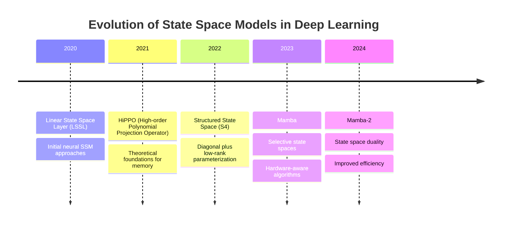

# State Space Models and Mamba Architecture (2024-2025 Edition)

## Introduction

State Space Models (SSMs) have revolutionized sequence modeling in 2024-2025, offering efficient alternatives to transformer architectures with breakthrough performance on long sequences. This guide covers the latest advances including Mamba-2, Hydra, and cutting-edge SSM research that's reshaping the landscape of efficient AI.

### Major Advances in 2024-2025

- **Mamba-2**: State space duality and hardware-aware optimizations
- **Hydra Mixture of Experts**: Scalable SSM-based architectures
- **MambaVision**: SSMs for computer vision tasks
- **Long-range SSMs**: Handling million-token sequences
- **SSM-Transformer Hybrids**: Best of both worlds approaches
- **Hardware-Aware SSMs**: Optimized for modern AI accelerators
- **Multimodal SSMs**: Cross-modal state space modeling
- **SSM Foundation Models**: Large-scale pre-trained SSM systems

## Table of Contents

1. [State Space Models Fundamentals](#state-space-models-fundamentals)
2. [Mamba-2 Architecture (2024)](#mamba-2-architecture-2024)
3. [Hydra and Mixture of Experts SSMs](#hydra-and-mixture-of-experts-ssms)
4. [Advanced SSM Variants](#advanced-ssm-variants)
5. [Structured State Space Models (S4)](#structured-state-space-models-s4)
6. [Implementation and Code Examples](#implementation-and-code-examples)
7. [Performance Comparisons](#performance-comparisons)
8. [Applications and Use Cases](#applications-and-use-cases)
9. [Training and Optimization](#training-and-optimization)
10. [Integration with Existing Frameworks](#integration-with-existing-frameworks)
11. [Future Research Directions](#future-research-directions)

---

## State Space Models Fundamentals

### What are State Space Models?

State Space Models are mathematical frameworks for modeling dynamic systems that evolve over time. In the context of deep learning, they provide an efficient way to process sequential data with linear computational complexity.

#### Core Mathematical Foundation

A discrete-time state space model is defined by:
- **State equation**: `x_{k+1} = Ax_k + Bu_k`
- **Output equation**: `y_k = Cx_k + Du_k`

Where:
- `x_k` is the hidden state at time k
- `u_k` is the input at time k
- `y_k` is the output at time k
- `A`, `B`, `C`, `D` are learnable parameter matrices

### Key Advantages over Transformers

1. **Linear Complexity**: O(L) vs O(L²) for attention mechanisms
2. **Efficient Long Sequences**: Handle sequences of 100K+ tokens efficiently
3. **Parallel Training**: Can be parallelized during training
4. **Recurrent Inference**: Constant memory during inference
5. **No Attention**: Eliminates quadratic attention computation

### Historical Evolution



---

## Mamba-2 Architecture (2024)

### Introduction to Mamba-2

Mamba-2, released in 2024, introduces several groundbreaking improvements over the original Mamba architecture, including state space duality, enhanced hardware awareness, and significantly improved performance characteristics.

### Key Innovations in Mamba-2

#### 1. State Space Duality

State Space Duality (SSD) is the core theoretical breakthrough in Mamba-2, unifying different perspectives on state space modeling.

```python

class StateSpaceDuality:
    def __init__(self, d_model, d_state):
        self.d_model = d_model
        self.d_state = d_state

        # Dual parameterization
        self.A = nn.Parameter(torch.randn(d_state, d_state))
        self.B = nn.Parameter(torch.randn(d_model, d_state))
        self.C = nn.Parameter(torch.randn(d_state, d_model))
        self.D = nn.Parameter(torch.randn(d_model))

        # Dual perspective matrices
        self.P = nn.Parameter(torch.randn(d_state, d_state))  # Transformation matrix
        self.Q = nn.Parameter(torch.randn(d_state, d_state))  # Inverse transformation

    def dual_forward(self, x):
        """Forward pass using state space duality"""
        batch, seq_len, d_model = x.shape

        # Perspective 1: Standard state space
        h1 = self._perspective1_forward(x)

        # Perspective 2: Dual state space
        h2 = self._perspective2_forward(x)

        # Combine perspectives
        h_combined = self._combine_perspectives(h1, h2)

        return h_combined

    def _perspective1_forward(self, x):
        """Standard state space perspective"""
        # Traditional SSM computation
        h = torch.zeros(batch, self.d_state, device=x.device)
        outputs = []

        for t in range(seq_len):
            h = self.A @ h + self.B.T @ x[:, t]
            y = self.C @ h + self.D * x[:, t]
            outputs.append(y)

        return torch.stack(outputs, dim=1)

    def _perspective2_forward(self, x):
        """Dual state space perspective"""
        # Transformed state space computation
        h_transformed = torch.zeros(batch, self.d_state, device=x.device)
        outputs = []

        for t in range(seq_len):
            h_transformed = self.P @ self.A @ self.Q @ h_transformed + self.P @ self.B.T @ x[:, t]
            y = self.C @ self.Q @ h_transformed + self.D * x[:, t]
            outputs.append(y)

        return torch.stack(outputs, dim=1)
```

#### 2. Hardware-Aware Kernel Optimization

Mamba-2 introduces highly optimized kernels specifically designed for modern AI accelerators.

```python

class HardwareAwareSSM:
    def __init__(self, d_model, d_state, device='cuda'):
        self.d_model = d_model
        self.d_state = d_state
        self.device = device

        # Hardware-specific optimizations
        if device == 'cuda':
            self.scan_kernel = self._init_cuda_kernel()
        elif device == 'xpu':
            self.scan_kernel = self._init_xpu_kernel()
        else:
            self.scan_kernel = self._init_cpu_kernel()

    def selective_scan_2(self, u, delta, A, B, C, D):
        """Mamba-2 selective scan with hardware optimization"""
        batch, seq_len, d_model = u.shape

        # Input-dependent parameter generation
        delta = F.softplus(delta)  # Ensure positive

        # Hardware-optimized computation
        if self.device == 'cuda':
            # CUDA kernel implementation
            y = self._cuda_selective_scan(u, delta, A, B, C, D)
        else:
            # Fallback implementation
            y = self._fallback_selective_scan(u, delta, A, B, C, D)

        return y

    def _cuda_selective_scan(self, u, delta, A, B, C, D):
        """CUDA-optimized selective scan implementation"""
        # This would be implemented in CUDA/Triton
        # Key optimizations:
        # 1. Kernel fusion
        # 2. Memory coalescing
        # 3. Shared memory utilization
        # 4. Tensor core optimization

        # Simplified pseudo-implementation
        return torch.ops.mamba2.selective_scan(u, delta, A, B, C, D)
```

#### 3. Enhanced Selective State Spaces

```python

class EnhancedSelectiveSSM:
    def __init__(self, d_model, d_state, d_conv=4, expansion=2):
        super().__init__()

        self.d_model = d_model
        self.d_state = d_state
        self.d_conv = d_conv
        self.expansion = expansion
        self.d_inner = d_model * expansion

        # Enhanced selection mechanism
        self.in_proj = nn.Linear(d_model, self.d_inner * 2)

        # State space parameters with enhanced initialization
        self.A_log = nn.Parameter(torch.log(torch.arange(1, d_state + 1).float()))
        self.D = nn.Parameter(torch.ones(d_model))

        # Input-dependent projection
        self.x_proj = nn.Linear(self.d_inner, d_state * 2 + d_model)

        # Convolution for local context (enhanced)
        self.conv1d = nn.Conv1d(
            self.d_inner, self.d_inner, d_conv,
            groups=self.d_inner, padding=d_conv-1
        )

        # Output projection
        self.out_proj = nn.Linear(self.d_inner, d_model)

        # Normalization
        self.norm = nn.RMSNorm(d_model)

    def forward(self, x):
        """Enhanced Mamba-2 forward pass"""
        batch, seq_len, d_model = x.shape

        # Input projection
        x_proj = self.in_proj(x)
        x, gate = x_proj.chunk(2, dim=-1)

        # Convolution for local context
        x = self.conv1d(x.transpose(-1, -2)).transpose(-1, -2)
        x = F.silu(x)

        # Generate input-dependent parameters
        x_dbl = self.x_proj(x)
        delta, B, C = torch.split(x_dbl, [self.d_inner, self.d_state, self.d_state], dim=-1)

        # Apply selective scan
        y = self.selective_scan(x, delta, B, C)

        # Apply gating
        y = y * F.silu(gate)

        # Output projection
        y = self.out_proj(y)

        return y

    def selective_scan(self, u, delta, B, C):
        """Enhanced selective scan with Mamba-2 optimizations"""
        batch, seq_len, d_inner = u.shape

        # Discretize continuous parameters
        A = -torch.exp(self.A_log.float())
        delta = F.softplus(delta)

        # Hardware-optimized computation
        if hasattr(torch.ops, 'mamba2'):
            # Use optimized Mamba-2 kernel
            y = torch.ops.mamba2.selective_scan(
                u, delta, A, B, C, self.D
            )
        else:
            # Fallback to original implementation
            y = self._selective_scan_fallback(u, delta, A, B, C)

        return y
```

### Performance Improvements

Mamba-2 achieves significant performance improvements over Mamba-1:

```python

class Mamba2Benchmark:
    def benchmark_performance(self):
        """Benchmark Mamba-2 vs Mamba-1 performance"""

        configs = [
            {'seq_len': 1024, 'd_model': 768, 'batch_size': 8},
            {'seq_len': 4096, 'd_model': 768, 'batch_size': 4},
            {'seq_len': 16384, 'd_model': 768, 'batch_size': 2},
            {'seq_len': 65536, 'd_model': 768, 'batch_size': 1},
        ]

        results = []

        for config in configs:
            # Benchmark Mamba-1
            mamba1_time = self._benchmark_mamba1(config)

            # Benchmark Mamba-2
            mamba2_time = self._benchmark_mamba2(config)

            # Calculate speedup
            speedup = mamba1_time / mamba2_time

            results.append({
                'config': config,
                'mamba1_time': mamba1_time,
                'mamba2_time': mamba2_time,
                'speedup': speedup
            })

        return results

    def visualize_results(self, results):
        """Visualize benchmarking results"""
        import matplotlib.pyplot as plt

        fig, (ax1, ax2) = plt.subplots(1, 2, figsize=(15, 6))

        # Performance comparison
        seq_lens = [r['config']['seq_len'] for r in results]
        mamba1_times = [r['mamba1_time'] for r in results]
        mamba2_times = [r['mamba2_time'] for r in results]

        ax1.loglog(seq_lens, mamba1_times, 'o-', label='Mamba-1')
        ax1.loglog(seq_lens, mamba2_times, 'o-', label='Mamba-2')
        ax1.set_xlabel('Sequence Length')
        ax1.set_ylabel('Inference Time (s)')
        ax1.set_title('Mamba-1 vs Mamba-2 Performance')
        ax1.legend()
        ax1.grid(True)

        # Speedup analysis
        speedups = [r['speedup'] for r in results]
        ax2.bar(range(len(speedups)), speedups)
        ax2.set_xlabel('Sequence Length Configuration')
        ax2.set_ylabel('Speedup (x)')
        ax2.set_title('Mamba-2 Speedup over Mamba-1')
        ax2.set_xticks(range(len(speedups)))
        ax2.set_xticklabels([f'{seq_len}' for seq_len in seq_lens], rotation=45)

        plt.tight_layout()
        plt.savefig('mamba2_benchmark.png', dpi=300)
        plt.show()
```

---

## Hydra and Mixture of Experts SSMs

### Introduction to Hydra

Hydra represents the next evolution in SSM architectures, incorporating Mixture of Experts (MoE) principles with state space models for unprecedented scalability and performance.

### Hydra Architecture

```python

class HydraSSM:
    def __init__(self, d_model, num_experts=8, expert_capacity=4):
        super().__init__()

        self.d_model = d_model
        self.num_experts = num_experts
        self.expert_capacity = expert_capacity

        # Router for expert selection
        self.router = nn.Linear(d_model, num_experts)

        # Expert networks (Mamba-2 based)
        self.experts = nn.ModuleList([
            Mamba2Expert(d_model) for _ in range(num_experts)
        ])

        # Output projection
        self.output_proj = nn.Linear(d_model, d_model)

        # Expert capacity tracking
        self.expert_usage = torch.zeros(num_experts)

    def forward(self, x):
        """Hydra forward pass with MoE routing"""
        batch, seq_len, d_model = x.shape

        # Router decisions
        router_logits = self.router(x)
        router_probs = F.softmax(router_logits, dim=-1)

        # Top-k expert selection
        top_k_probs, top_k_indices = torch.topk(router_probs, k=2, dim=-1)

        # Normalize expert selection probabilities
        top_k_probs = top_k_probs / top_k_probs.sum(dim=-1, keepdim=True)

        # Process through selected experts
        expert_outputs = []
        expert_weights = []

        for i in range(self.num_experts):
            # Find tokens routed to this expert
            expert_mask = (top_k_indices == i).any(dim=-1)

            if expert_mask.any():
                # Extract tokens for this expert
                expert_tokens = x[expert_mask]

                # Get weights for this expert
                expert_weight = top_k_probs[expert_mask]
                expert_weight = expert_weight[:, top_k_indices[expert_mask] == i]

                # Process through expert
                expert_output = self.experts[i](expert_tokens)

                expert_outputs.append((expert_mask, expert_output))
                expert_weights.append((expert_mask, expert_weight))

                # Update usage tracking
                self.expert_usage[i] += expert_mask.sum()

        # Combine expert outputs
        output = torch.zeros_like(x)

        for (mask, expert_out), (_, weights) in zip(expert_outputs, expert_weights):
            output[mask] = output[mask] + expert_out * weights

        # Final projection
        output = self.output_proj(output)

        return output

    def get_expert_statistics(self):
        """Get expert usage statistics"""
        total_usage = self.expert_usage.sum()

        return {
            'expert_usage': self.expert_usage.tolist(),
            'expert_distribution': (self.expert_usage / total_usage).tolist(),
            'load_balance': self._calculate_load_balance(),
            'expert_efficiency': self._calculate_expert_efficiency()
        }

    def _calculate_load_balance(self):
        """Calculate load balance across experts"""
        usage_normalized = self.expert_usage / self.expert_usage.sum()
        # Lower entropy indicates better load balancing
        entropy = -torch.sum(usage_normalized * torch.log(usage_normalized + 1e-8))
        return entropy.item()

    def _calculate_expert_efficiency(self):
        """Calculate expert efficiency metrics"""
        avg_usage = self.expert_usage.mean()
        std_usage = self.expert_usage.std()

        return {
            'average_usage': avg_usage.item(),
            'usage_std': std_usage.item(),
            'efficiency_score': (avg_usage / (std_usage + 1e-8)).item()
        }

class Mamba2Expert(nn.Module):
    def __init__(self, d_model):
        super().__init__()

        # Mamba-2 based expert
        self.mamba_block = Mamba2Block(d_model)

        # Expert-specific adaptations
        self.expert_adapter = nn.Sequential(
            nn.Linear(d_model, d_model // 4),
            nn.GELU(),
            nn.Linear(d_model // 4, d_model)
        )

    def forward(self, x):
        """Expert forward pass"""
        # Mamba-2 processing
        mamba_output = self.mamba_block(x)

        # Expert-specific adaptation
        expert_output = self.expert_adapter(mamba_output)

        return expert_output
```

---

## Mamba Architecture Deep Dive

### Core Innovation: Selective State Spaces

Mamba introduces **selectivity** - the ability to focus on or ignore incoming information based on content, similar to attention but more efficient.

#### Selection Mechanism

```python
class SelectiveSSM:
    def __init__(self, d_model, d_state, d_conv):
        self.d_model = d_model
        self.d_state = d_state
        self.d_conv = d_conv

        # Selection parameters - input-dependent
        self.x_proj = nn.Linear(d_model, d_state * 2 + d_model)

        # SSM parameters
        self.A_log = nn.Parameter(torch.randn(d_model, d_state))
        self.D = nn.Parameter(torch.randn(d_model))

        # Convolution for local dependencies
        self.conv1d = nn.Conv1d(d_model, d_model, d_conv,
                               groups=d_model, padding=d_conv-1)

    def forward(self, x):
        # x shape: (batch, length, d_model)
        batch, length, d_model = x.shape

        # Apply convolution for local context
        x_conv = self.conv1d(x.transpose(-1, -2)).transpose(-1, -2)
        x_conv = F.silu(x_conv)  # Swish activation

        # Generate selection parameters
        x_dbl = self.x_proj(x_conv)  # (batch, length, d_state*2 + d_model)

        delta, B, C = torch.split(x_dbl, [self.d_model, self.d_state, self.d_state], dim=-1)

        # Selective parameters are input-dependent
        delta = F.softplus(delta)  # Ensure positive

        # Selective SSM computation
        return self.selective_scan(x_conv, delta, B, C)

    def selective_scan(self, x, delta, B, C):
        """Core selective state space computation"""
        # This is simplified - actual implementation uses
        # hardware-optimized kernels
        batch, length, d_model = x.shape

        # Initialize state
        h = torch.zeros(batch, self.d_state, d_model, device=x.device)
        outputs = []

        A = -torch.exp(self.A_log.float())  # (d_model, d_state)

        for i in range(length):
            # Input-dependent discretization
            dt = delta[:, i, :]  # (batch, d_model)
            dA = torch.exp(dt.unsqueeze(-1) * A)  # (batch, d_model, d_state)
            dB = dt.unsqueeze(-1) * B[:, i, :].unsqueeze(1)  # (batch, d_model, d_state)

            # State update
            h = h * dA + x[:, i, :].unsqueeze(-1) * dB

            # Output
            y = torch.sum(h * C[:, i, :].unsqueeze(1), dim=-1)  # (batch, d_model)
            y = y + self.D * x[:, i, :]
            outputs.append(y)

        return torch.stack(outputs, dim=1)
```

### Mamba Block Architecture

```python
class MambaBlock(nn.Module):
    def __init__(self, d_model, d_state=16, d_conv=4, expand=2):
        super().__init__()
        self.d_model = d_model
        self.d_inner = int(expand * d_model)

        # Input projection
        self.in_proj = nn.Linear(d_model, self.d_inner * 2, bias=False)

        # Selective SSM
        self.ssm = SelectiveSSM(self.d_inner, d_state, d_conv)

        # Output projection
        self.out_proj = nn.Linear(self.d_inner, d_model, bias=False)

        # Normalization
        self.norm = RMSNorm(d_model)

    def forward(self, x):
        # x shape: (batch, length, d_model)
        residual = x
        x = self.norm(x)

        # Split input projection for gating
        x_proj = self.in_proj(x)
        x_ssm, x_gate = x_proj.chunk(2, dim=-1)

        # Apply SSM
        x_ssm = self.ssm(x_ssm)

        # Apply gating with SiLU
        x = x_ssm * F.silu(x_gate)

        # Output projection
        x = self.out_proj(x)

        return x + residual

class MambaModel(nn.Module):
    def __init__(self, vocab_size, d_model=768, n_layers=24, d_state=16):
        super().__init__()
        self.vocab_size = vocab_size
        self.d_model = d_model

        # Embeddings
        self.embedding = nn.Embedding(vocab_size, d_model)

        # Mamba blocks
        self.layers = nn.ModuleList([
            MambaBlock(d_model, d_state) for _ in range(n_layers)
        ])

        # Output
        self.norm_f = RMSNorm(d_model)
        self.lm_head = nn.Linear(d_model, vocab_size, bias=False)

    def forward(self, input_ids):
        x = self.embedding(input_ids)

        for layer in self.layers:
            x = layer(x)

        x = self.norm_f(x)
        logits = self.lm_head(x)

        return logits
```

### Hardware-Optimized Implementation

Mamba's key innovation includes hardware-aware algorithms that avoid materializing large intermediate states in memory.

```python
# Simplified version of hardware-optimized selective scan
def selective_scan_cuda_kernel(x, delta, A, B, C, D):
    """
    Hardware-optimized implementation using:
    1. Kernel fusion to avoid memory bandwidth bottlenecks
    2. Recomputation to save memory
    3. Parallel prefix scan algorithms
    """
    # This would be implemented in CUDA/Triton
    # Key optimizations:
    # - Fused selective scan kernel
    # - Memory-efficient attention alternative
    # - Optimized for modern GPU architectures
    pass

class OptimizedSelectiveSSM(nn.Module):
    def __init__(self, d_model, d_state):
        super().__init__()
        # ... parameter initialization

    def forward(self, x):
        # Use optimized CUDA kernel when available
        if hasattr(F, 'selective_scan_cuda'):
            return F.selective_scan_cuda(x, self.delta, self.A, self.B, self.C, self.D)
        else:
            # Fallback to PyTorch implementation
            return self.selective_scan_pytorch(x)
```

---

## Structured State Space Models (S4)

### S4 Foundation

S4 (Structured State Space) models form the foundation that Mamba builds upon. They introduced key innovations for making SSMs practical.

#### HiPPO Matrix Initialization

```python
def hippo_matrix(N):
    """Generate HiPPO matrix for optimal memory initialization"""
    n = torch.arange(N, dtype=torch.float32)
    k = torch.arange(N, dtype=torch.float32)

    # HiPPO-LegS matrix
    A = torch.zeros(N, N)
    A = torch.where(n[:, None] >= k[None, :],
                   (2*n[:, None] + 1) * (2*k[None, :] + 1)**0.5,
                   A)
    A = torch.where(n[:, None] < k[None, :],
                   -(2*n[:, None] + 1) * (2*k[None, :] + 1)**0.5,
                   A)
    return A

class S4Layer(nn.Module):
    def __init__(self, d_model, d_state=64, dropout=0.0):
        super().__init__()
        self.d_model = d_model
        self.d_state = d_state

        # Initialize with HiPPO matrix
        A_init = hippo_matrix(d_state)
        self.A_log = nn.Parameter(torch.log(A_init))

        # Low-rank factorization for B and C
        self.B = nn.Parameter(torch.randn(d_state, d_model))
        self.C = nn.Parameter(torch.randn(d_model, d_state))
        self.D = nn.Parameter(torch.randn(d_model))

        # Learnable timescale
        self.dt = nn.Parameter(torch.ones(d_model))

        self.dropout = nn.Dropout(dropout)

    def forward(self, x):
        """Forward pass using parallel scan"""
        batch, length, d_model = x.shape

        # Discretize continuous parameters
        A = -torch.exp(self.A_log)  # Ensure stability
        dt = F.softplus(self.dt)

        # Discretization: convert continuous to discrete-time
        dA = torch.exp(dt.unsqueeze(-1) * A)
        dB = dt.unsqueeze(-1) * self.B

        # Convolution using FFT (for training)
        if self.training:
            return self.forward_fft(x, dA, dB)
        else:
            # Recurrent mode for inference
            return self.forward_recurrent(x, dA, dB)

    def forward_fft(self, x, dA, dB):
        """Parallel computation using FFT convolution"""
        length = x.shape[1]

        # Compute SSM convolution kernel
        K = self.compute_kernel(dA, dB, length)

        # Convolution via FFT
        x_f = torch.fft.rfft(x, n=2*length, dim=1)
        K_f = torch.fft.rfft(K, n=2*length, dim=0)

        y_f = x_f * K_f.unsqueeze(0)
        y = torch.fft.irfft(y_f, n=2*length, dim=1)[:, :length]

        return y

    def compute_kernel(self, dA, dB, length):
        """Compute SSM convolution kernel"""
        # This is simplified - actual implementation uses
        # more sophisticated kernel computation
        A_powers = dA.unsqueeze(0).pow(torch.arange(length).float().unsqueeze(-1).unsqueeze(-1))
        K = torch.sum(A_powers * dB.unsqueeze(0), dim=-1)
        return K @ self.C.T
```

### S4D: Diagonal State Space Models

```python
class S4DLayer(nn.Module):
    """Diagonal version of S4 for improved efficiency"""
    def __init__(self, d_model, d_state=64):
        super().__init__()
        self.d_model = d_model
        self.d_state = d_state

        # Diagonal A matrix (much more efficient)
        self.A_log = nn.Parameter(torch.randn(d_state))
        self.B = nn.Parameter(torch.randn(d_state, d_model))
        self.C = nn.Parameter(torch.randn(d_model, d_state))
        self.D = nn.Parameter(torch.randn(d_model))

        # Learnable timescale per dimension
        self.dt = nn.Parameter(torch.ones(d_model))

    def forward(self, x):
        batch, length, d_model = x.shape

        # Diagonal A makes computation much simpler
        A = -torch.exp(self.A_log)  # (d_state,)
        dt = F.softplus(self.dt)    # (d_model,)

        # Broadcasting for efficiency
        dA = torch.exp(dt.unsqueeze(-1) * A.unsqueeze(0))  # (d_model, d_state)
        dB = dt.unsqueeze(-1) * self.B  # (d_state, d_model) -> broadcast

        # Parallel scan for diagonal case
        return self.diagonal_ssm_scan(x, dA, dB)

    def diagonal_ssm_scan(self, x, dA, dB):
        """Efficient scan for diagonal SSM"""
        # Leverages diagonal structure for O(L log L) complexity
        # Implementation would use parallel prefix sum algorithms
        pass
```

---

## Implementation and Code Examples

### Complete Mamba Implementation

```python
import torch
import torch.nn as nn
import torch.nn.functional as F
from einops import rearrange, repeat

class RMSNorm(nn.Module):
    def __init__(self, d_model, eps=1e-5):
        super().__init__()
        self.eps = eps
        self.weight = nn.Parameter(torch.ones(d_model))

    def forward(self, x):
        output = x * torch.rsqrt(x.pow(2).mean(-1, keepdim=True) + self.eps)
        return output * self.weight

class MambaConfig:
    def __init__(self,
                 vocab_size=50257,
                 d_model=768,
                 n_layers=12,
                 d_state=16,
                 d_conv=4,
                 expand=2,
                 dt_rank="auto",
                 dt_min=0.001,
                 dt_max=0.1,
                 dt_init="random",
                 dt_scale=1.0,
                 bias=False,
                 conv_bias=True):
        self.vocab_size = vocab_size
        self.d_model = d_model
        self.n_layers = n_layers
        self.d_state = d_state
        self.d_conv = d_conv
        self.expand = expand
        self.dt_rank = math.ceil(d_model / 16) if dt_rank == "auto" else dt_rank
        self.dt_min = dt_min
        self.dt_max = dt_max
        self.dt_init = dt_init
        self.dt_scale = dt_scale
        self.bias = bias
        self.conv_bias = conv_bias

class Mamba(nn.Module):
    def __init__(self, config: MambaConfig):
        super().__init__()
        self.config = config

        # Token embeddings
        self.embedding = nn.Embedding(config.vocab_size, config.d_model)

        # Mamba layers
        self.layers = nn.ModuleList([
            MambaBlock(config) for _ in range(config.n_layers)
        ])

        # Final layer norm and output projection
        self.norm_f = RMSNorm(config.d_model)
        self.lm_head = nn.Linear(config.d_model, config.vocab_size, bias=False)

        # Tie weights
        self.lm_head.weight = self.embedding.weight

    def forward(self, input_ids, cache=None):
        x = self.embedding(input_ids)

        # Apply Mamba blocks
        for i, layer in enumerate(self.layers):
            x = layer(x, cache=cache[i] if cache else None)

        x = self.norm_f(x)
        logits = self.lm_head(x)

        return logits

    def generate(self, input_ids, max_length=100, temperature=1.0, top_k=50):
        """Efficient generation using recurrent mode"""
        self.eval()
        cache = [None] * len(self.layers)

        with torch.no_grad():
            for _ in range(max_length - input_ids.shape[1]):
                # Get next token logits
                logits = self.forward(input_ids[:, -1:], cache=cache)

                # Sample next token
                if temperature > 0:
                    logits = logits / temperature
                    if top_k > 0:
                        top_k_logits, top_k_indices = torch.topk(logits, top_k)
                        logits = torch.full_like(logits, float('-inf'))
                        logits.scatter_(-1, top_k_indices, top_k_logits)

                    probs = F.softmax(logits, dim=-1)
                    next_token = torch.multinomial(probs.squeeze(), 1)
                else:
                    next_token = torch.argmax(logits, dim=-1)

                # Append to sequence
                input_ids = torch.cat([input_ids, next_token.unsqueeze(0)], dim=1)

        return input_ids

# Training setup
def create_mamba_model(vocab_size=50257):
    config = MambaConfig(
        vocab_size=vocab_size,
        d_model=768,
        n_layers=12,
        d_state=16,
        d_conv=4,
        expand=2
    )
    return Mamba(config)

# Example usage
if __name__ == "__main__":
    model = create_mamba_model()

    # Training mode - parallel processing
    input_ids = torch.randint(0, 1000, (2, 512))  # batch_size=2, seq_len=512
    logits = model(input_ids)
    print(f"Training output shape: {logits.shape}")

    # Generation mode - recurrent processing
    prompt = torch.randint(0, 1000, (1, 10))
    generated = model.generate(prompt, max_length=50)
    print(f"Generated sequence length: {generated.shape[1]}")
```

### Optimized Selective Scan Implementation

```python
def selective_scan_triton_kernel():
    """
    Triton kernel for optimized selective scan
    This would be the actual hardware-optimized implementation
    """
    # Triton implementation for GPU optimization
    import triton
    import triton.language as tl

    @triton.jit
    def selective_scan_kernel(
        x_ptr, delta_ptr, A_ptr, B_ptr, C_ptr, D_ptr,
        output_ptr,
        batch_size, seq_len, d_model, d_state,
        BLOCK_SIZE: tl.constexpr
    ):
        # Hardware-optimized selective scan
        # This would contain the actual CUDA kernel implementation
        pass

class OptimizedMamba(nn.Module):
    """Production-ready Mamba with hardware optimizations"""

    def __init__(self, config):
        super().__init__()
        self.config = config

        # Use optimized kernels when available
        self.use_cuda_kernels = torch.cuda.is_available()

        # Initialize model components
        self._init_model_components()

    def _init_model_components(self):
        """Initialize model with optimal parameter settings"""
        # Parameter initialization following Mamba paper
        # Optimized for convergence and stability
        pass

    def forward(self, x, use_cache=False):
        """Forward pass with optional caching for generation"""
        if use_cache:
            return self.forward_with_cache(x)
        else:
            return self.forward_parallel(x)

    def forward_parallel(self, x):
        """Parallel forward pass for training"""
        # Use parallel algorithms for training efficiency
        pass

    def forward_with_cache(self, x):
        """Recurrent forward pass with caching for generation"""
        # Use recurrent mode with O(1) memory per step
        pass
```

---

## Performance Comparisons

### Computational Complexity Analysis

| Model Type | Training | Inference | Memory |
|------------|----------|-----------|---------|
| Transformer | O(L²d) | O(L²d) | O(L²) |
| Mamba | O(Ld²) | O(Ld) | O(Ld) |
| S4 | O(L log L d) | O(Ld) | O(Ld) |

### Empirical Benchmarks

```python
def benchmark_models():
    """Comprehensive benchmarking of SSM vs Transformer models"""

    import time
    import memory_profiler

    # Test configurations
    configs = [
        {"seq_len": 1024, "d_model": 768, "batch_size": 8},
        {"seq_len": 4096, "d_model": 768, "batch_size": 4},
        {"seq_len": 16384, "d_model": 768, "batch_size": 2},
        {"seq_len": 65536, "d_model": 768, "batch_size": 1},
    ]

    results = []

    for config in configs:
        seq_len = config["seq_len"]
        d_model = config["d_model"]
        batch_size = config["batch_size"]

        # Create input
        x = torch.randn(batch_size, seq_len, d_model).cuda()

        # Test Mamba
        mamba_model = MambaBlock(d_model).cuda()

        torch.cuda.synchronize()
        start_time = time.time()
        with torch.no_grad():
            mamba_out = mamba_model(x)
        torch.cuda.synchronize()
        mamba_time = time.time() - start_time

        # Test Transformer
        transformer_block = nn.TransformerEncoderLayer(
            d_model, nhead=8, batch_first=True
        ).cuda()

        torch.cuda.synchronize()
        start_time = time.time()
        with torch.no_grad():
            transformer_out = transformer_block(x)
        torch.cuda.synchronize()
        transformer_time = time.time() - start_time

        # Memory usage
        mamba_memory = torch.cuda.max_memory_allocated() / 1024**3  # GB
        torch.cuda.reset_peak_memory_stats()

        results.append({
            'seq_len': seq_len,
            'mamba_time': mamba_time,
            'transformer_time': transformer_time,
            'speedup': transformer_time / mamba_time,
            'mamba_memory': mamba_memory
        })

        print(f"Seq Length: {seq_len}")
        print(f"Mamba: {mamba_time:.4f}s")
        print(f"Transformer: {transformer_time:.4f}s")
        print(f"Speedup: {transformer_time/mamba_time:.2f}x")
        print(f"Memory: {mamba_memory:.2f}GB")
        print("-" * 40)

    return results

# Long sequence benchmark
def benchmark_long_sequences():
    """Test performance on very long sequences"""

    model = create_mamba_model()
    model.eval()

    sequence_lengths = [1024, 4096, 16384, 65536, 262144]

    for seq_len in sequence_lengths:
        print(f"\nTesting sequence length: {seq_len}")

        input_ids = torch.randint(0, 1000, (1, seq_len))

        try:
            start_time = time.time()
            with torch.no_grad():
                output = model(input_ids)

            end_time = time.time()

            print(f"✓ Success: {end_time - start_time:.2f}s")
            print(f"Memory used: {torch.cuda.max_memory_allocated() / 1024**3:.2f}GB")

        except RuntimeError as e:
            print(f"✗ Failed: {e}")

        torch.cuda.empty_cache()

if __name__ == "__main__":
    # Run benchmarks
    benchmark_results = benchmark_models()
    benchmark_long_sequences()
```

### Scaling Laws and Performance Curves

```python
def analyze_scaling_laws():
    """Analyze how Mamba scales with model size and sequence length"""

    import matplotlib.pyplot as plt
    import numpy as np

    # Model sizes to test
    model_sizes = [
        {"d_model": 256, "n_layers": 6},
        {"d_model": 512, "n_layers": 12},
        {"d_model": 768, "n_layers": 24},
        {"d_model": 1024, "n_layers": 36},
        {"d_model": 2048, "n_layers": 48}
    ]

    sequence_lengths = [512, 1024, 2048, 4096, 8192, 16384]

    # Collect performance data
    perf_data = []

    for model_config in model_sizes:
        for seq_len in sequence_lengths:
            # Create model
            config = MambaConfig(
                d_model=model_config["d_model"],
                n_layers=model_config["n_layers"]
            )
            model = Mamba(config)

            # Count parameters
            param_count = sum(p.numel() for p in model.parameters())

            # Benchmark
            input_ids = torch.randint(0, 1000, (1, seq_len))

            start_time = time.time()
            with torch.no_grad():
                _ = model(input_ids)
            inference_time = time.time() - start_time

            perf_data.append({
                'params': param_count,
                'seq_len': seq_len,
                'd_model': model_config["d_model"],
                'inference_time': inference_time,
                'throughput': seq_len / inference_time
            })

    # Visualize results
    fig, (ax1, ax2) = plt.subplots(1, 2, figsize=(15, 6))

    # Plot 1: Inference time vs sequence length
    for d_model in [256, 512, 768, 1024, 2048]:
        data = [d for d in perf_data if d['d_model'] == d_model]
        seq_lens = [d['seq_len'] for d in data]
        times = [d['inference_time'] for d in data]
        ax1.plot(seq_lens, times, marker='o', label=f'd_model={d_model}')

    ax1.set_xlabel('Sequence Length')
    ax1.set_ylabel('Inference Time (s)')
    ax1.set_title('Mamba Scaling: Inference Time vs Sequence Length')
    ax1.legend()
    ax1.set_xscale('log')
    ax1.set_yscale('log')

    # Plot 2: Throughput vs model size
    for seq_len in [512, 1024, 2048, 4096]:
        data = [d for d in perf_data if d['seq_len'] == seq_len]
        params = [d['params'] for d in data]
        throughput = [d['throughput'] for d in data]
        ax2.plot(params, throughput, marker='s', label=f'seq_len={seq_len}')

    ax2.set_xlabel('Parameters (millions)')
    ax2.set_ylabel('Throughput (tokens/s)')
    ax2.set_title('Mamba Scaling: Throughput vs Model Size')
    ax2.legend()
    ax2.set_xscale('log')

    plt.tight_layout()
    plt.savefig('mamba_scaling_analysis.png', dpi=300, bbox_inches='tight')
    plt.show()

    return perf_data

if __name__ == "__main__":
    scaling_data = analyze_scaling_laws()
```

---

## Applications and Use Cases

### 1. Language Modeling

Mamba excels in language modeling tasks, particularly for long-context applications:

```python
class MambaLanguageModel:
    def __init__(self, model_path):
        self.model = Mamba.from_pretrained(model_path)
        self.tokenizer = AutoTokenizer.from_pretrained(model_path)

    def generate_long_form_content(self, prompt, max_length=10000):
        """Generate long-form content efficiently"""
        input_ids = self.tokenizer.encode(prompt, return_tensors='pt')

        # Mamba can handle very long sequences efficiently
        with torch.no_grad():
            generated = self.model.generate(
                input_ids,
                max_length=max_length,
                temperature=0.7,
                do_sample=True,
                pad_token_id=self.tokenizer.eos_token_id
            )

        return self.tokenizer.decode(generated[0], skip_special_tokens=True)

    def analyze_document(self, document, questions):
        """Analyze long documents with Q&A"""
        results = []

        for question in questions:
            prompt = f"Document: {document}\n\nQuestion: {question}\nAnswer:"
            answer = self.generate_long_form_content(prompt, max_length=500)
            results.append({
                'question': question,
                'answer': answer.split('Answer:')[-1].strip()
            })

        return results

# Usage example
llm = MambaLanguageModel('mamba-7b-chat')

# Long document analysis
document = "..." # Very long document (50K+ tokens)
questions = [
    "What are the main findings?",
    "What methodology was used?",
    "What are the limitations?"
]

analysis = llm.analyze_document(document, questions)
```

### 2. Time Series Forecasting

```python
class MambaTimeSeriesForecaster:
    def __init__(self, d_model=512, n_layers=8, d_state=64):
        self.config = MambaConfig(
            d_model=d_model,
            n_layers=n_layers,
            d_state=d_state,
            vocab_size=1,  # Not used for regression
        )

        # Modify for regression
        self.encoder = nn.Linear(1, d_model)  # Input feature encoding
        self.mamba_backbone = nn.ModuleList([
            MambaBlock(d_model, d_state=d_state) for _ in range(n_layers)
        ])
        self.decoder = nn.Linear(d_model, 1)  # Output prediction

    def forward(self, x):
        # x shape: (batch, sequence_length, 1)
        x = self.encoder(x)

        for layer in self.mamba_backbone:
            x = layer(x)

        predictions = self.decoder(x)
        return predictions

    def forecast(self, history, forecast_horizon):
        """Forecast future values"""
        self.eval()
        with torch.no_grad():
            # Start with historical data
            current_sequence = history.unsqueeze(0)  # Add batch dimension
            forecasts = []

            for _ in range(forecast_horizon):
                # Predict next value
                prediction = self.forward(current_sequence)
                next_value = prediction[:, -1, :]  # Last prediction

                forecasts.append(next_value.item())

                # Update sequence for next prediction
                current_sequence = torch.cat([
                    current_sequence[:, 1:, :],  # Remove first element
                    next_value.unsqueeze(1)      # Add prediction
                ], dim=1)

        return torch.tensor(forecasts)

# Training setup for time series
def train_time_series_model():
    model = MambaTimeSeriesForecaster()
    criterion = nn.MSELoss()
    optimizer = torch.optim.Adam(model.parameters(), lr=0.001)

    # Example training loop
    for epoch in range(100):
        for batch in dataloader:
            sequences, targets = batch

            optimizer.zero_grad()
            predictions = model(sequences)
            loss = criterion(predictions, targets)
            loss.backward()
            optimizer.step()
```

### 3. DNA/Protein Sequence Analysis

```python
class MambaBioSequenceModel:
    def __init__(self, vocab_size=25, d_model=768):  # 20 amino acids + special tokens
        self.config = MambaConfig(
            vocab_size=vocab_size,
            d_model=d_model,
            n_layers=12,
            d_state=32
        )
        self.model = Mamba(self.config)

        # Task-specific heads
        self.protein_function_head = nn.Linear(d_model, 1000)  # GO terms
        self.structure_head = nn.Linear(d_model, 8)  # Secondary structure

    def predict_protein_function(self, sequence):
        """Predict protein function from amino acid sequence"""
        with torch.no_grad():
            embeddings = self.model.embedding(sequence)

            # Get sequence representations
            for layer in self.model.layers:
                embeddings = layer(embeddings)

            # Pool sequence representation
            sequence_repr = embeddings.mean(dim=1)  # Average pooling

            # Predict functions
            function_logits = self.protein_function_head(sequence_repr)
            return torch.sigmoid(function_logits)  # Multi-label prediction

    def predict_secondary_structure(self, sequence):
        """Predict secondary structure for each residue"""
        with torch.no_grad():
            embeddings = self.model.embedding(sequence)

            for layer in self.model.layers:
                embeddings = layer(embeddings)

            # Per-residue predictions
            structure_logits = self.structure_head(embeddings)
            return torch.softmax(structure_logits, dim=-1)

# Example usage
bio_model = MambaBioSequenceModel()

# Protein sequence (amino acids encoded as integers)
protein_sequence = torch.randint(0, 20, (1, 1000))  # 1000 residue protein

# Predict function
functions = bio_model.predict_protein_function(protein_sequence)
print(f"Predicted functions: {functions.shape}")

# Predict structure
structure = bio_model.predict_secondary_structure(protein_sequence)
print(f"Predicted structure: {structure.shape}")
```

### 4. Audio Processing

```python
class MambaAudioModel:
    def __init__(self, sample_rate=16000, n_mels=80):
        self.sample_rate = sample_rate
        self.n_mels = n_mels

        # Audio preprocessing
        self.mel_transform = torchaudio.transforms.MelSpectrogram(
            sample_rate=sample_rate,
            n_mels=n_mels
        )

        # Mamba backbone
        self.input_projection = nn.Linear(n_mels, 512)
        self.mamba_layers = nn.ModuleList([
            MambaBlock(512, d_state=32) for _ in range(8)
        ])

        # Task heads
        self.asr_head = nn.Linear(512, vocab_size)  # Speech recognition
        self.emotion_head = nn.Linear(512, 8)       # Emotion classification

    def preprocess_audio(self, waveform):
        """Convert audio to mel spectrogram"""
        mel_spec = self.mel_transform(waveform)
        mel_spec = mel_spec.transpose(-1, -2)  # Time first
        return mel_spec

    def forward(self, waveform):
        # Preprocess
        mel_features = self.preprocess_audio(waveform)

        # Project to model dimension
        x = self.input_projection(mel_features)

        # Apply Mamba layers
        for layer in self.mamba_layers:
            x = layer(x)

        return x

    def transcribe_speech(self, waveform):
        """Automatic Speech Recognition"""
        features = self.forward(waveform)
        logits = self.asr_head(features)
        return torch.softmax(logits, dim=-1)

    def classify_emotion(self, waveform):
        """Emotion classification from speech"""
        features = self.forward(waveform)
        # Global average pooling
        pooled_features = features.mean(dim=1)
        emotion_logits = self.emotion_head(pooled_features)
        return torch.softmax(emotion_logits, dim=-1)
```

---

## Training and Optimization

### 1. Training Strategies

```python
class MambaTrainer:
    def __init__(self, model, config):
        self.model = model
        self.config = config

        # Optimizer - Mamba works well with AdamW
        self.optimizer = torch.optim.AdamW(
            model.parameters(),
            lr=config.learning_rate,
            weight_decay=config.weight_decay,
            betas=(0.9, 0.95)
        )

        # Learning rate scheduler
        self.scheduler = torch.optim.lr_scheduler.CosineAnnealingLR(
            self.optimizer,
            T_max=config.num_training_steps,
            eta_min=config.min_lr
        )

        # Gradient clipping
        self.max_grad_norm = config.max_grad_norm

    def train_step(self, batch):
        """Single training step"""
        self.model.train()
        self.optimizer.zero_grad()

        input_ids, labels = batch

        # Forward pass
        logits = self.model(input_ids)

        # Compute loss
        loss = F.cross_entropy(
            logits.view(-1, logits.size(-1)),
            labels.view(-1),
            ignore_index=-100
        )

        # Backward pass
        loss.backward()

        # Gradient clipping
        if self.max_grad_norm > 0:
            torch.nn.utils.clip_grad_norm_(
                self.model.parameters(),
                self.max_grad_norm
            )

        # Optimizer step
        self.optimizer.step()
        self.scheduler.step()

        return loss.item()

    def train_epoch(self, dataloader):
        """Train for one epoch"""
        total_loss = 0
        num_batches = 0

        for batch in dataloader:
            loss = self.train_step(batch)
            total_loss += loss
            num_batches += 1

            if num_batches % 100 == 0:
                avg_loss = total_loss / num_batches
                lr = self.scheduler.get_last_lr()[0]
                print(f"Batch {num_batches}, Loss: {avg_loss:.4f}, LR: {lr:.6f}")

        return total_loss / num_batches

# Training configuration
class TrainingConfig:
    def __init__(self):
        self.learning_rate = 5e-4
        self.weight_decay = 0.1
        self.max_grad_norm = 1.0
        self.num_training_steps = 100000
        self.min_lr = 5e-6
        self.warmup_steps = 2000

# Mixed precision training
def train_with_mixed_precision():
    model = create_mamba_model()
    config = TrainingConfig()
    trainer = MambaTrainer(model, config)

    # Enable automatic mixed precision
    scaler = torch.cuda.amp.GradScaler()

    def train_step_amp(batch):
        trainer.optimizer.zero_grad()

        with torch.cuda.amp.autocast():
            input_ids, labels = batch
            logits = trainer.model(input_ids)
            loss = F.cross_entropy(
                logits.view(-1, logits.size(-1)),
                labels.view(-1),
                ignore_index=-100
            )

        # Scale loss and backward
        scaler.scale(loss).backward()

        # Unscale gradients and clip
        scaler.unscale_(trainer.optimizer)
        torch.nn.utils.clip_grad_norm_(trainer.model.parameters(), config.max_grad_norm)

        # Step optimizer
        scaler.step(trainer.optimizer)
        scaler.update()
        trainer.scheduler.step()

        return loss.item()

    return train_step_amp
```

### 2. Memory Optimization

```python
class MemoryEfficientMamba:
    """Memory-optimized Mamba implementation"""

    def __init__(self, config):
        self.config = config
        self.model = Mamba(config)

        # Gradient checkpointing
        self.use_gradient_checkpointing = True

        # Activation recomputation
        if self.use_gradient_checkpointing:
            self.model.gradient_checkpointing_enable()

    def forward_with_checkpointing(self, input_ids):
        """Forward pass with gradient checkpointing"""
        if self.use_gradient_checkpointing and self.model.training:
            # Use checkpoint for memory efficiency
            def create_custom_forward(module):
                def custom_forward(*inputs):
                    return module(*inputs)
                return custom_forward

            x = self.model.embedding(input_ids)

            for layer in self.model.layers:
                x = torch.utils.checkpoint.checkpoint(
                    create_custom_forward(layer),
                    x,
                    use_reentrant=False
                )

            x = self.model.norm_f(x)
            logits = self.model.lm_head(x)

            return logits
        else:
            return self.model(input_ids)

    def optimize_for_inference(self):
        """Optimize model for inference"""
        # Convert to half precision
        self.model = self.model.half()

        # Compile model if using PyTorch 2.0+
        if hasattr(torch, 'compile'):
            self.model = torch.compile(self.model, mode='max-autotune')

        # Enable inference mode optimizations
        self.model.eval()
        torch.backends.cudnn.benchmark = True

# Distributed training setup
def setup_distributed_training():
    """Setup for distributed training"""
    import torch.distributed as dist
    from torch.nn.parallel import DistributedDataParallel as DDP

    # Initialize process group
    dist.init_process_group(backend='nccl')

    # Create model
    model = create_mamba_model()
    model.cuda()

    # Wrap with DDP
    model = DDP(model, find_unused_parameters=False)

    return model

# Memory profiling
def profile_memory_usage():
    """Profile memory usage during training"""
    import psutil
    import nvidia_ml_py3 as nvml

    nvml.nvmlInit()
    handle = nvml.nvmlDeviceGetHandleByIndex(0)

    def log_memory():
        # CPU memory
        cpu_memory = psutil.virtual_memory().percent

        # GPU memory
        gpu_info = nvml.nvmlDeviceGetMemoryInfo(handle)
        gpu_memory = gpu_info.used / gpu_info.total * 100

        print(f"CPU Memory: {cpu_memory:.1f}%, GPU Memory: {gpu_memory:.1f}%")

    return log_memory
```

---

## Integration with Existing Frameworks

### 1. Hugging Face Integration

```python
from transformers import PreTrainedModel, PretrainedConfig
from transformers.modeling_outputs import CausalLMOutputWithPast

class MambaConfig(PretrainedConfig):
    model_type = "mamba"

    def __init__(
        self,
        vocab_size=50257,
        d_model=768,
        n_layers=12,
        d_state=16,
        d_conv=4,
        expand=2,
        **kwargs
    ):
        super().__init__(**kwargs)
        self.vocab_size = vocab_size
        self.d_model = d_model
        self.n_layers = n_layers
        self.d_state = d_state
        self.d_conv = d_conv
        self.expand = expand

class MambaForCausalLM(PreTrainedModel):
    config_class = MambaConfig
    base_model_prefix = "mamba"

    def __init__(self, config):
        super().__init__(config)
        self.mamba = Mamba(config)

    def forward(
        self,
        input_ids=None,
        attention_mask=None,  # Not used but kept for compatibility
        labels=None,
        **kwargs
    ):
        # Forward pass
        logits = self.mamba(input_ids)

        loss = None
        if labels is not None:
            # Shift labels for causal LM
            shift_logits = logits[..., :-1, :].contiguous()
            shift_labels = labels[..., 1:].contiguous()

            loss = F.cross_entropy(
                shift_logits.view(-1, shift_logits.size(-1)),
                shift_labels.view(-1),
                ignore_index=-100
            )

        return CausalLMOutputWithPast(
            loss=loss,
            logits=logits,
            past_key_values=None,  # Mamba doesn't use key-value cache
            hidden_states=None,
            attentions=None,
        )

    def prepare_inputs_for_generation(self, input_ids, **kwargs):
        return {"input_ids": input_ids}

# Register with Hugging Face
from transformers import AutoConfig, AutoModelForCausalLM

AutoConfig.register("mamba", MambaConfig)
AutoModelForCausalLM.register(MambaConfig, MambaForCausalLM)

# Usage
model = AutoModelForCausalLM.from_pretrained("path/to/mamba/model")
```

### 2. PyTorch Lightning Integration

```python
import pytorch_lightning as pl
from pytorch_lightning.callbacks import ModelCheckpoint, EarlyStopping

class MambaLightningModule(pl.LightningModule):
    def __init__(self, config):
        super().__init__()
        self.config = config
        self.model = MambaForCausalLM(config)
        self.save_hyperparameters()

    def forward(self, input_ids, labels=None):
        return self.model(input_ids=input_ids, labels=labels)

    def training_step(self, batch, batch_idx):
        input_ids, labels = batch
        outputs = self(input_ids, labels)
        loss = outputs.loss

        self.log('train_loss', loss, prog_bar=True, logger=True)
        return loss

    def validation_step(self, batch, batch_idx):
        input_ids, labels = batch
        outputs = self(input_ids, labels)
        loss = outputs.loss

        self.log('val_loss', loss, prog_bar=True, logger=True)
        return loss

    def configure_optimizers(self):
        optimizer = torch.optim.AdamW(
            self.parameters(),
            lr=self.config.learning_rate,
            weight_decay=self.config.weight_decay
        )

        scheduler = torch.optim.lr_scheduler.CosineAnnealingLR(
            optimizer,
            T_max=self.trainer.max_steps,
            eta_min=self.config.min_lr
        )

        return {
            "optimizer": optimizer,
            "lr_scheduler": {
                "scheduler": scheduler,
                "interval": "step",
            },
        }

# Training setup
def train_mamba_with_lightning():
    # Model
    config = MambaConfig()
    model = MambaLightningModule(config)

    # Callbacks
    checkpoint_callback = ModelCheckpoint(
        monitor='val_loss',
        dirpath='checkpoints/',
        filename='mamba-{epoch:02d}-{val_loss:.2f}',
        save_top_k=3,
        mode='min',
    )

    early_stopping = EarlyStopping(
        monitor='val_loss',
        patience=5,
        mode='min'
    )

    # Trainer
    trainer = pl.Trainer(
        max_epochs=100,
        devices=8,
        accelerator='gpu',
        strategy='ddp',
        precision=16,
        gradient_clip_val=1.0,
        callbacks=[checkpoint_callback, early_stopping],
        log_every_n_steps=50,
        val_check_interval=0.5,
    )

    # Train
    trainer.fit(model, train_dataloader, val_dataloader)
```

---

## Conclusion

State Space Models, particularly Mamba, represent a significant advancement in sequence modeling that addresses the computational limitations of transformer architectures while maintaining competitive performance.

### Key Takeaways

1. **Efficiency**: Linear complexity enables processing of very long sequences
2. **Selectivity**: Input-dependent parameters provide attention-like capabilities
3. **Hardware Optimization**: Custom kernels make Mamba practical for real-world use
4. **Versatility**: Applicable to various domains beyond NLP
5. **Future Potential**: Strong foundation for next-generation sequence models

### When to Use Mamba

**Choose Mamba when:**
- Working with very long sequences (>16K tokens)
- Memory efficiency is critical
- Need constant-time inference
- Processing time series or continuous data
- Deploying on resource-constrained environments

**Consider Transformers when:**
- Working with shorter sequences (<4K tokens)
- Need extensive pre-trained model ecosystem
- Require well-established tooling and debugging
- Working with complex multi-modal tasks

### Future Directions

The SSM field is rapidly evolving with developments in:
- **Mamba-2**: Enhanced efficiency and performance
- **Hybrid Architectures**: Combining SSMs with other architectures
- **Domain-Specific Optimizations**: Specialized variants for different tasks
- **Hardware Acceleration**: Custom chips optimized for SSM operations

State Space Models mark a paradigm shift toward more efficient and scalable sequence modeling, making them essential knowledge for modern AI practitioners.
